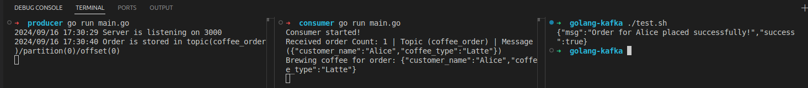

## Có 2 phần:
  1. Producer
  2. Consumer (hoặc gọi là worker)
  
## Cách để chạy
```sh
docker compose up -d

cd producer && go run main.go
```

Mở 1 terminal khác
```sh
cd consumer && go run main.go
```


Mở 1 terminal khác để test curl
```sh
./test.sh
```

Kết quả

